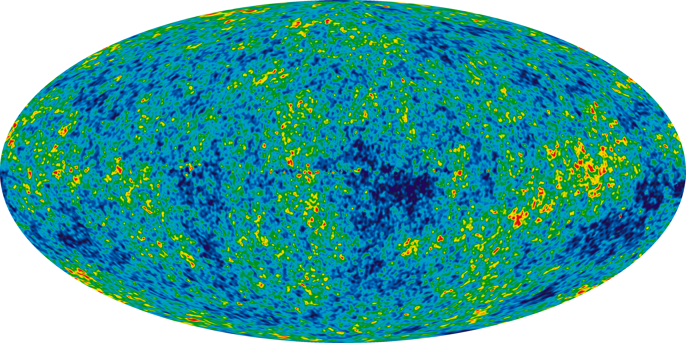
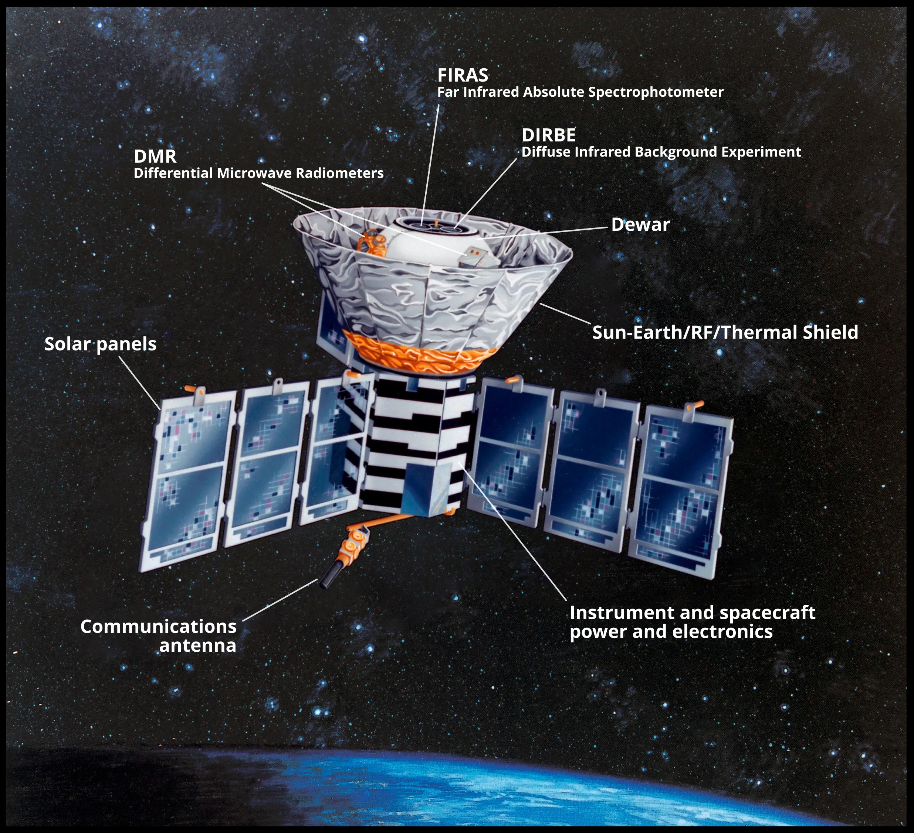
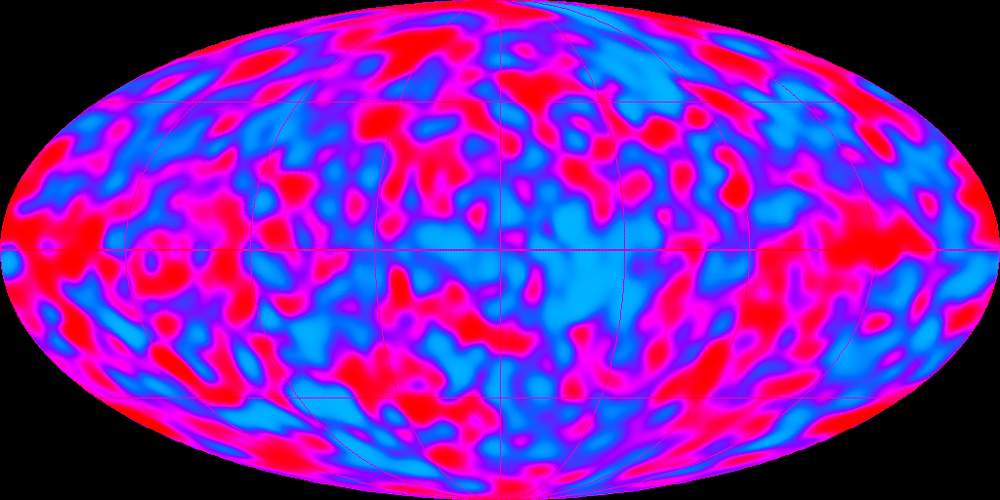
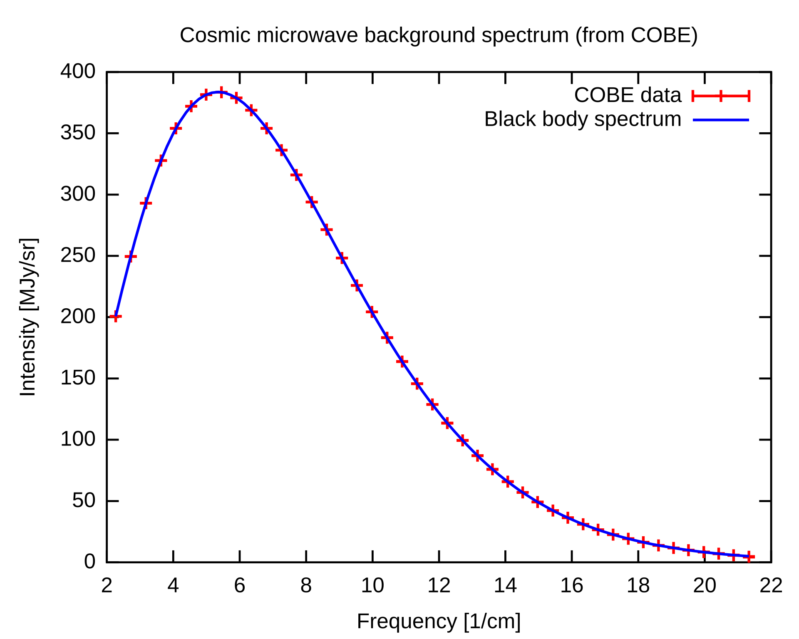
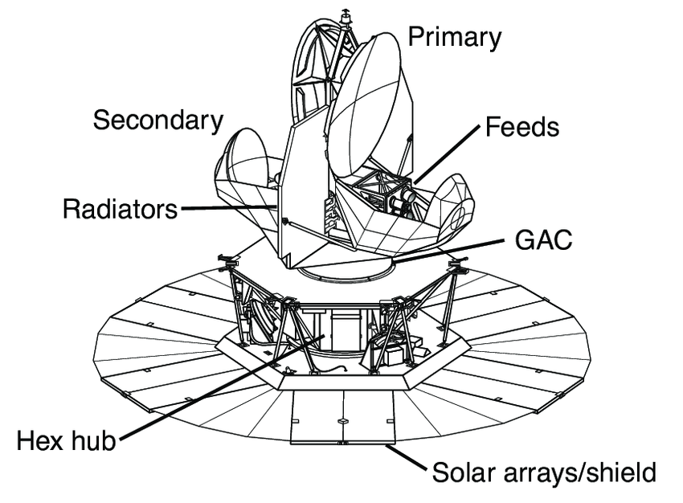
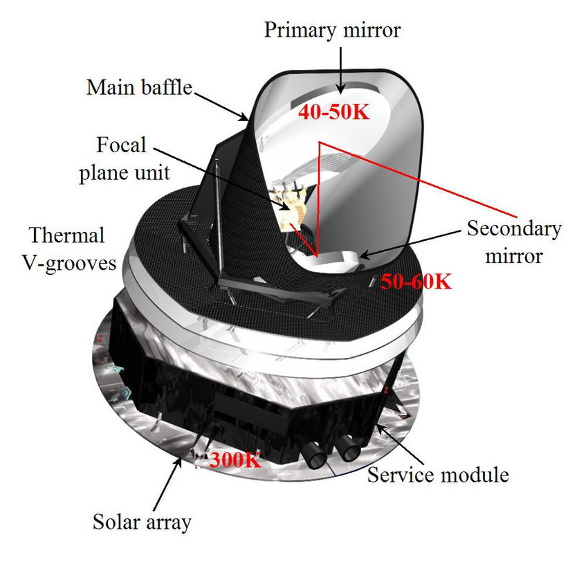
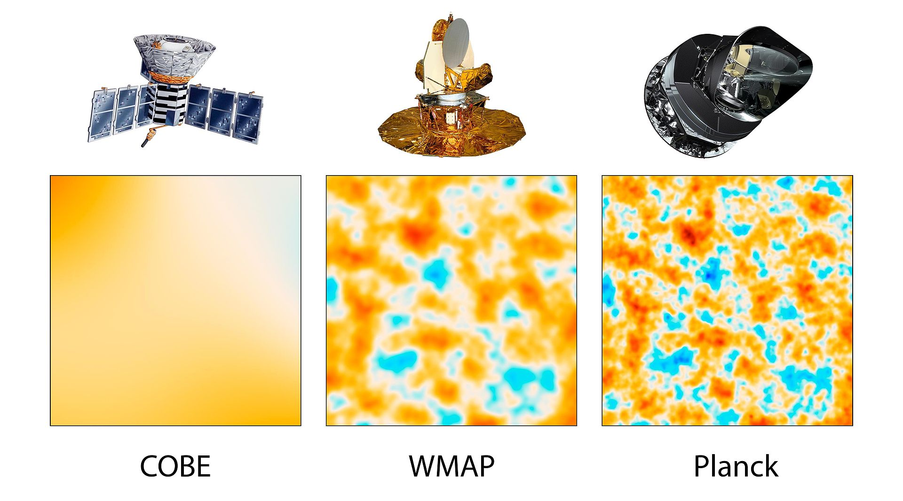
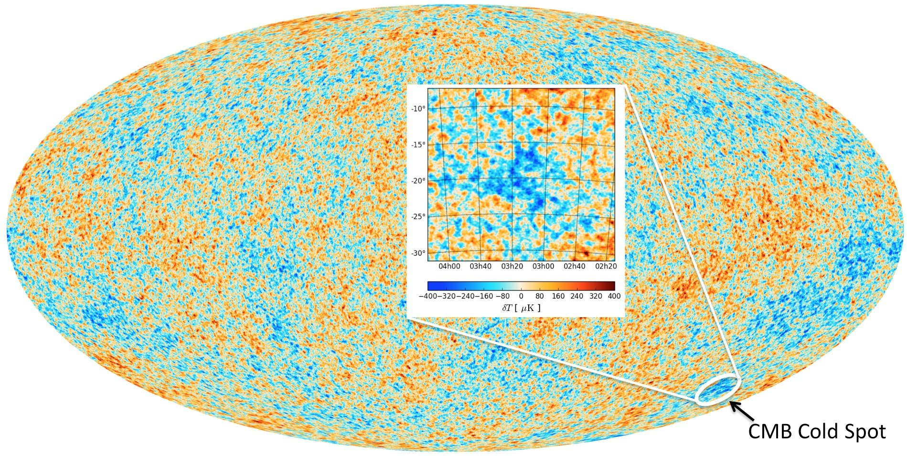
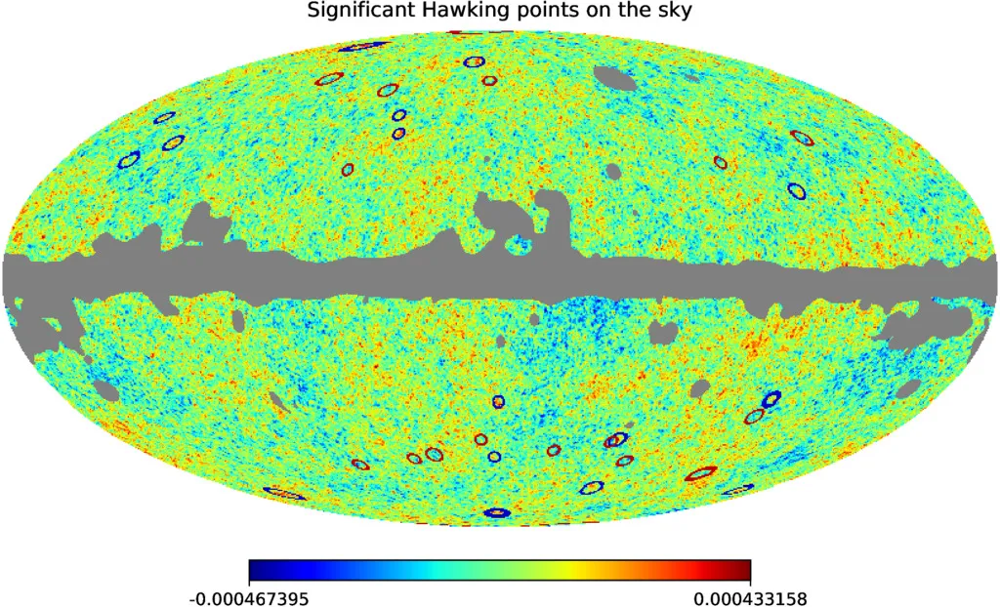

# CMB Processing Project Overview
This is a WIP project on understanding the process behind cleaning/processing CMB images. The goal is to better understand the CMB, the instruments used to create these images, and how to make them look pretty. As of now it just imports already clean images and displays them...

# Theory (not finished)
To better understand each aspect of this project, I've done research on the cosmic microwave background and its notable anisotropies.

## What is the cosmic microwave background?
The cosmic microwave background (CMB) is the oldest detectable light in the universe. It is a near uniform glow of blackbody thermal radiation, which is detectable from all directions. It dates back to around 380,000 years after the Big Bang, when the universe first became transparent.

## Timeline Pre-CMB

### Super Hot Epoch
For a long time after the Big Bang, the universe was an extremely hot and dense plasma. It was so hot that light and matter were inseperable. As the universe expanded and cooled, particles such as electrons and nuclei began to form. Photons at this time were constantly scattered off of free electrons.

The temperature was still too high for stable atoms to exist. Instead, the universe remained a hot, opaque plasma. Particles raced around at very high speeds, colliding and breaking apart. But within all this chaos were tiny gravitational fluctuations which rippled throughout the plasma. These very minor irregularities would later be the foundation of cosmic structure.

### The Epoch of Recombination
This epoch began when the early universe became cool enough to support electrons and protons combining to form electrically neutral hydrogen atoms. Since light was no longer being scattered by free electrons, photons could freely travel across space. The universe was finally transparent and the light being emitted right before this time (redshifted to microwave wavelengths) is now what we know as the cosmic microwave background.

## How did we discover the CMB?
The CMB was first discovered in 1964 by Arno Penzias and Robert Wilson. They detected a persistent microwave "noise" when using the Holmdel Horn Antenna. After removing every single other possible source, they realized these signals matched predictions from Big Bang cosmology. At the time, it was believed that this signal was uniform since the equipment could not resolve the small fluctuations of the CMB.

## CMB Data Collection Missions

### Cosmic Background Explorer (COBE)
Launched by NASA in November 1989, the Cosmic Background Explorer (COBE) was the first satellite dedicated to precice measurements of the CMB. It carried three instruments: the Far-Infrared Absolute Spectrophotometer (FIRAS), the Differential Microwave Radiometer (DMR), and the Diffuse Infrared Background Experiment (DIRBE).

The DMR used three different radiometers to map the sky at 31.4, 53, and 90 GHz. It was primaraly responsible for detecting anisotropies. 

DIRBE had a cryogenically cooled multiband radiometer for diffuse infrared radiation from 1 to 300 micrometers. This infrared background provided insight on early universe structure and galaxy formation. 

FIRAS used a cryogenically cooled polarizing Michelson interferometer as a Fourier transform spectrometer. This instrument measured the CMB with precision and confirmed that it follows a near perfect blackbody curve at a temperature of 2.725K.

### Wilkinson Microwave Anistropy Probe (WMAP)
Launched in June 2001, the Wilkinson Microwave Anistropy Probe (WMAP) was NASA's successor to COBE which was designed to map the CMB with much higher resolution. It observed five frequencies (22 to 90 GHz) with the goal to measure and subtract foreground contamination from the Milky Way and other galactic sources.

The WMAP data was released after one year and every two years after that (up to nine years). The main results of the WMAP experiments were a higher resolution CMB sky map and an estimate of the age of the universe (13.8 billion years). WMAP also refined nearly all key parameters of the Lambda-CDM model.

### Planck Satellite 
The Planck Satellite was launched by the European Space Agency in May 2009 and was the most advanced CMB mission. It mapped the CMB in nine frequency bands using the "High-Frequency Instrument" (HFI) which measured 100 - 857 GHz and the "Low-Frequency Instrument" (LFI) whcih measured 30 - 70 GHz.

The data from the Planck mission was released in 2013, 2015, and most recently, 2018. The final data release in 2018 remains the gold standard for CMB studies. This satellite is responsible for the sharpest image of the CMB to date, refining WMAP's findings with five times better resolution, the most precise measuremens of cosmological paramaters such as the Hubble Constant (67.8 km/s/Mpc) and the age of the universe (13.82 billion years), and polarization data that further confirmed cosmic inflation.

## Anisotrophies

### What is an anisotropy?
Anisotropies are tiny temperature fluctuations in the CMB which are on the order of microkelvin. These variations may seem insignificant, but they reveal subtle differences in the density of matter when the universe was very young. Without these anisotropies, galaxies, stars, and planets might never have formed. 

### The Cold Spot
The cold spot is approximately 70 microkelvin cooler than the surrounding area and spans about 5 degrees. It was first detected by the Wilkinson Microwave Anisotropy Prope (WMAP). The probability of this cold spot existing is ~ 1.85%. Some believe it could be a large empty region of space which cooled photons as they passed through.

### Hawking Points
Hawking points are a theoretical explination for circular patterns in the CMB caused by evaporating black holes from a previous cosmic cycle. These would be points of slightly higher temperature, but the evidence for them are highly controversial and aren't widely accepted.

# Cleaning CMB Data
thats the goal...
